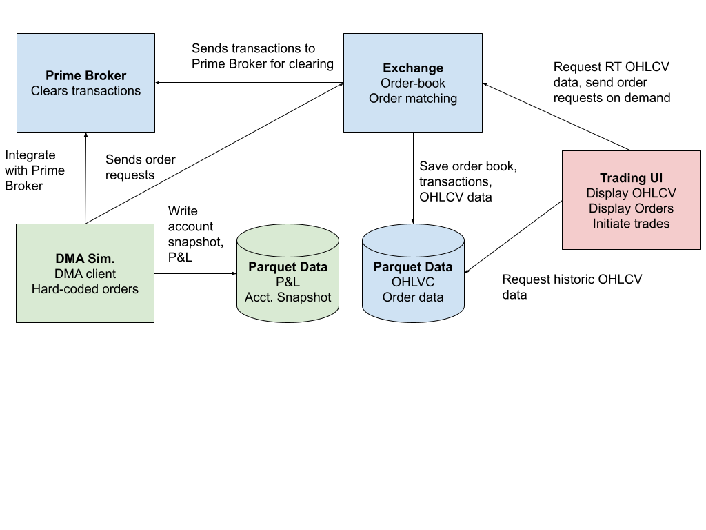

# Market Simulator Design

# Overview

We build a stochastic model of an asset market (e.g. equities, commodities, forex, crypto, etc.). The simulation will include individual participants who make decisions to buy or sell assets based on their individual strategies. 

The goal is to understand the underlying dynamics of markets, and how they lead to (often unexpected) various results. Some examples:

* How market behavior changes with various:  
  * layers of interaction (DMAs, brokers, retail traders, wholesalers, etc.).  
  * market products (margin, derivatives, etc.).  
* Why returns are not normally distributed i.e. why return distributions have “fat tails”.  
* How bid-ask spreads emerge and how market microstructure changes with maker/taker fee structure.  
* How bubbles form and pop.  
* How price discovery works.  
* How well various strategies perform.  
* How information flow influences market behavior.  
* How “market manipulation” might work.  
* What happens when liquidity “dries up”.  
* How HFT market makers and Wholesalers make money, and if they are are net positive for assets and/or retail traders.  
* Whether or not common technical patterns naturally emerge in the price data, and if so how.

Additionally, we simply want to see to what degree simulating market behavior is possible. Aside from the technical challenges associated with simulating the (potentially complex) decisions for \~millions of participants, is it possible that we can find underlying statistical distributions for those decisions that adequately simulate data which is statistically similar to real markets?

At a high level, we will build an exchange, and various levels of participation with the exchange (institutions with Direct Market Access or DMAs, broker-dealers, retail traders, wholesalers, market makers/High Frequency Traders or HFTs, HFT statistical arbitrage algorithms, etc.). We will model their behavior stochastically and save generated data including order book modifications over time, transactions (price data), account snapshot data, and configuration metadata. We will also build a UI for observing trade data (order book depth, candlestick data and trade volume or “OHLCV”), either on replay or as the data is generated.

The project will be built in multiple phases, and each phase will have multiple iterations. We start with a relatively simple exchange and only DMAs, and gradually increase complexity with each iteration and phase.

# High-level design

## Infrastructure

To start, we build the project using Python due to the proliferation of statistical libraries from which to build on. This is likely more of a prototype, as we expect to need a more performant compiled language (C++ or Rust) as complexity increases. The Python simulation will be a proof-of-concept and provide an idea for how complex we can potentially make our simulator.

We use Claude Code in VS Code (or Cursor) for development. All code will have unit tests, and we strive for relatively comprehensive end-to-end testing. We use github for the code repository. Code must compile and tests must pass before checking in to the repository.

We write all log data to Parquet, and generally analyze the data in Jupyter. We will include analysis code in either a separate directory within the repository or as a separate repository in github. Additionally, we will include a web-based UI for streaming OHLCV data using [TradingView lightweight charts](https://www.tradingview.com/lightweight-charts/).

For hardware, we will start with a consumer laptop (8GB Apple MacBook Air with an Apple M1 chip). As we increase in complexity, we will re-evaluate hardware (as with language) as performance requirements increase.

## Feasibility

Initially, we will simulate a market for a single equity (mid-cap, medium volume), and potentially scale up from there. We want to estimate memory and run-time requirements to simulate a day of data. The following is an estimate from [Gemini](https://gemini.google.com/app/13c8d6c0756d83c7) for how many orders we should expect to simulate per day (Note that [Claude](https://claude.ai/chat/dab4f946-0dc9-4e48-9c04-4310adef412c) has estimated similar numbers):

| Category | Typical Example | Daily Trade Volume | Est. Daily Messages (All Venues) | Avg. Msgs / Sec (Peak can be 10x-50x) |
| :---- | :---- | :---- | :---- | :---- |
| 1\. Mid-Cap (Russell 2000\) | e.g., SWTX, SKWD | 500k – 2M shares | 2M – 10M | 85 – 425 |
| 2\. High-Cap (S\&P 500\) | e.g., JPM, PG | 5M – 15M shares | 50M – 150M | 2,100 – 6,400 |
| 3\. Mega-Cap (Mag 7\) | e.g., NVDA, AAPL | 40M – 100M+ shares | 500M – 1.5B+ | 21,000 – 64,000+ |

We focus on mid-cap here for now. We expect roughly \~85-425 messages per second. The exchange matching algorithm will need to process each of those, but we’ll assume that’s roughly O(1), or at worst O(logN) depending on the operation. We expect HFTs to provide the highest frequency interactions, so most of these will be HFTs (either stat arb, or more commonly MM). Both will perform a similar complexity of calculation. 

The analysis from [Claude](https://claude.ai/chat/dab4f946-0dc9-4e48-9c04-4310adef412c) estimates that these calculations can be simulated at approximately \~10-20 microseconds per event, as long as we are not directly adding network latency (we can simulate the latency), which is the real bottleneck for HFT algorithms. Assume the matching algorithm is roughly similar, and we have somewhere around \~50-120 microseconds per message (no network). For a 27,000s trading day, this leads to 275-1377s for a full simulated day. I have tested these numbers with some dummy calculations, and estimate roughly \~1800s of run-time per simulated day on the high-end. So this prototype is certainly feasible.

Higher volume equities start to get more difficult to simulate. In addition to the order(s) of magnitude larger frequencies, there is also additional complexity that we would need to include to faithfully simulate these markets (for example, options markets would need to be included since they drive a significant amount of order flow). Thus we will likely need to move to a compiled language (ideally with concurrency) in order to reasonably simulate these markets.

For now, we start with Python, as we expect the AI assisted development to perform better on python than a compiled language.

## Phases

We will build the simulation in multiple phases. The plan for these phases is as follows:

1. **Minimal exchange ecosystem** \- The exchange ecosystem will consist of 4 components.   
   1. The first component is the exchange itself, which maintains an order book and matches orders as they come in. The exchange will also record data to Parquet tables for later processing.  
   2. The second component is the “Direct Market Access” (or DMA) client. Essentially, this provides access to the exchange. All exchange requests will be made through the client. We will create a number of very simple simulated DMAs for testing the exchange.  
   3. The third is the Prime Broker (PB), which clears a DMA’s exchange order requests (DMA can request clearing before a trade), and settles transactions matched by the exchange.  
   4. The fourth is a simple trading UI to observe candlestick and volume data, and issue manual trades for a given (unsimulated) DMA client.

2. **Basic price discovery modeling** \- In phase 2, we build more complex DMA simulators. All market participants will be DMAs at this stage (even low information “retail” traders). They will vary in aspects like information level and sophistication, they will use this information to predict asset price, and decide to buy or sell accordingly. Here we will model both assets and information flow relatively simply. All participants will make decisions on similar time scales and on the same unitary event loop.

3. **Event loop efficiency** \- In phase 3, we begin modeling “engagement” between different DMAs. We expect to eventually simulate \~millions of market participants. In real markets (though we won’t fully model them here just yet), trade frequency varies between participants from many order requests per second (HFTs) to 1 trade every few years (retail investors) and everything in between. While not fully implementing their strategies, or fully simulating their institutional structures, we simply and efficiently model their various levels of engagement with the market over time. At this point, we hope to get a sense of what scale of simulation we can do (i.e. how many participants, orders/transactions per second), and may pivot to a compiled language accordingly.

4. **Analysis framework** \- Each phase from here will begin to get more and more complex, and at each stage we need to analyze the data for both sanity checks and see how simulated prices and returns evolve with each change. In phase 4, we build a simple analysis framework for analyzing price data.

5. **Complete market ecosystem** \- In phase 5, we model the ecosystem more completely:  
   1. We add structure for retail traders and discount brokers (retail traders interact through the market through discount brokers, not directly).  
   2. We add HFT market makers.  
   3. We add Wholesalers.  
   4. We formalize various other DMA institutions (ETFs, hedge funds, etc.).

6. **Asset modeling and information flow** \- In phase 6, we begin modeling “true” asset value more robustly. We add the concept of price factors (asset A is worth $X based on commonly known information, but the less commonly known factor y contributes \+/- $Z to the price). We model dissemination of information related to those factors. We also add low information strategies common with retail traders, and no information strategies and/or decisions common with ETFs and other institutions.

7. **Leverage and other improved sophistication** \- In phase 7, we add the concept of leverage (both long and short) and update various strategy models accordingly. We also add “hiding” strategies like iceberg trades, dark pool usage, stat. arb., day trading, market manipulation, etc. 

8. **Options markets** \- In phase 8, we explore adding derivatives, namely options markets. This will require a new exchange, new strategies, etc.

## Software engineering principles

* We use semantic versioning for each change (`vX.Y.Z`):   
  * Each phase increments the major version.  
  * Within each phase will be “iterations”. Each iteration will increment the minor version.  
  * All PRs (whether feature requests, or bug fixes, or anything else) will increment the micros version.  
* Architectural decisions should be made in collaboration between me and Claude Code, and should be signed off by me before executing.  
* We will use git for version control, and GitHub as a repository.  
* Most code-changes will be performed via Claude Code. Some will be written directly by me if I choose.  
* All code changes should be made in a branch with a naming convention like `feat/short-description` or `fix/short-description`.   
* All code changes should be either reviewed (most cases) via Pull Request or directly written by me before pushing to main. This is critical as I want to have a solid understanding of the code base as it increases in complexity.  
* Prefer small changes: one logical change per PR when changing behavior, with the caveat that tests should pass before checking in. For adding brand new features (e.g. adding the initial exchange) it may be simpler to include larger PRs.  
* PR descriptions should have the following format: 

  \`\`\`  
  \<branch name\> \- \<one sentence description\>

  \<bullet points describing changes\>  
  \`\`\`

  Err on the side of more verbosity in the paragraph describing the change.   
* Maintain a `CHANGELOG.md` file with the latest change at the top of the file, including the version, and the relevant changes (likely the same bullet description from the PR description.  
* If a task would require architectural decisions beyond the scope of the bug fix or feature request, Claude Code should stop and ask rather than deciding unilaterally.  
* Do not install new packages without flagging in the PR. Ideally, necessary packages should be decided at planning time.  
* Most of the code will be written in Python initially. Conform to the python style guide: [https://google.github.io/styleguide/pyguide.html](https://google.github.io/styleguide/pyguide.html). Any other code added should also follow a Google style guide ([https://google.github.io/styleguide/](https://google.github.io/styleguide/)), where appropriate.  
* Prefer readable code over concise but cryptic, unless it significantly affects performance.  
* Testing:   
  * We strive for reasonably good (95-100%) code coverage in unit tests.  
  * Prefer testing behavior over implementation. Do not write brittle tests that will break as things change.  
  * As large scale features and/or components are added, since this project will have many components, we also strive for a reasonable number of end-to-end tests to validate new changes.   
  * Both unit tests and end-to-end tests should pass before code is checked in to the main GitHub branch (to start, we will execute tests manually before opening the PR, but we may consider adding a Continuous Integration framework), so we want to balance robust test coverage with velocity.  
* This is a data project, so we will write many tables for later processing. Each table should have a corresponding run number within its file name. The run number will be associated with one or more “metadata” files, including the version of the code used, date of execution, and any configuration or input data used for the run.  
* There will be randomization in this project. For data generation (usually fast simulation) runs, all randomization should be initialized by a single (or a few) seeds. The seeds should be saved within the configuration data in order to repeat a run.

## Directory structure

`market-simulator/`  
`├── src/`  
`│   └── market_simulator/`  
`│       ├── __init__.py`  
`│       ├── core/  # Clock, enums, common util files`  
`│       ├── exchange/  # Exchange logic, access client, API definitions`  
`│       ├── participants/  # DMA impl., behavior simulation, etc.`  
`│       └── runner/  # Fast sim. runner, exchange server, etc.`  
`├── analysis/`  
`│   ├── notebooks/`  
`│   └── tools/`  
`├── trading_ui/`  
`├── tests/`  
`│   ├── unit/`  
`│   ├── e2e/`  
`│   └── fixtures/  # e2e input/output files (JSON configs, CSV data)`  
`├── bin/  # simulation entry points (e.g. run.py)`
`├── scripts/  # utility scripts (e.g. order message CSV generation)`
`├── configs/  # run configuration files (JSON configs, action CSVs)`
`│   └── actions/  # time-ordered order message CSVs`
`├── data/  # gitignored, Parquet output goes here by default`  
`├── pyproject.toml`  
`├── CHANGELOG.md`  
`├── CLAUDE.md`  
`├── DESIGNDOC.md`  
`└── README.md`

# Detailed design

## Phase 1 \- Minimal exchange ecosystem

To start, we will create a single exchange. The exchange will support multiple instruments, each with its own independent order book. The exchange will implement the order book data structure, and the order matching algorithm. The exchange should write order book and transaction data parquet files.

We will also add a “DMA client” which provides direct access to the exchange, and some number of dummy DMA simulations to interact with the exchange. The DMA sims will integrate with a Prime Broker, which settles transactions at a specified time (typically the start of the next trading day for equities, but we can also do immediate clearing for e.g. cryptocurrencies).

We will implement two modes for the exchange: a “fast simulation” (FS) mode and a “real-time” (RT) mode. In FS mode, the exchange and DMA simulate transactions as fast as possible, and we model the time logically. In RT mode, we add buffers to slow down simulated DMAs so that order messages appear to be sent in real time. We also add a Trading UI for viewing candlestick (OHLCV) and orderbook data. 

Finally, we add a Trading UI to observe trades. The trading UI can either read directly from the parquet, or from an API with the exchange for the latest up-to-date order book data. The UI should also have the ability to initiate trades for a specified DMA. In a later iteration, the exchange server will use WebSockets for transport — with protobuf serialization for participant-to-exchange communication and JSON for the Trading UI.

**Figure 1:** High-level architecture for Phase 1\.

All of this will be done over several iterations, as described below.

### Iteration 1 \- Exchange

The exchange will be a core component of the simulation. It’s main function is to listen for order messages from DMAs, maintain an order book, and match orders appropriately. In this iteration, order messages are processed strictly sequentially in a single thread. Exchange instances have some configuration options passed in as constructor arguments and which should have sensible defaults. One important configuration is hours and modes of operation. For now, just implement two modes (open or closed), with the runner explicitly opening and closing the exchange (clock-based market hours may be added in a later iteration). When the exchange closes, process any orders already submitted and maintain the order book for the next trading day.

Create a Clock object to provide timestamps. Time should be modeled in one of three ways:

1. In (pseudo) real time mode, the clock just passes through the wall time, potentially with a configurable offset.  
2. In fast simulation mode, the clock passes through a modeled time. The clock should have a method on it for advancing time only, either advance by some delta, or fast-forward to some specified time.  
3. In real time simulation mode, the clock advances time, but time fast-forward calls also “wait” (sleep) until the new (pseudo) time actually occurs. Fast-forward calls to a timestamp in the past should not sleep to allow for catch up in case simulated time falls behind the (pseudo) real-time.

The Clock is owned by the simulation runner (or test harness). The runner reads timestamps from the order message CSV and advances the clock to each timestamp before processing the corresponding message. In tests, time can be arbitrarily advanced as needed. At this stage, participants do not interact with the clock directly; if participants need to advance or query time in future phases, appropriate APIs will be designed at that point.

The exchange should have a configurable fee structure (e.g. makers get a rebate of 3bps, and takers pay a fee of 7bps). Fees and rebates are paid on fill and are rounded to the nearest $0.01, with fees rounded up and rebates rounded down. There is a minimum taker fee of $0.02 and a minimum maker rebate of $0.01, ensuring both the exchange and the maker always profit on each trade. For logging purposes, rebates and fees are both logged as fees. A rebate is a negative-valued fee.

The exchange exposes a unified request/response API that mirrors the future proto-based network interface. In single-process mode, the API uses plain Python dataclasses (`OrderMessageRequest`, `OrderMessageResponse`, `RegistrationResponse`) defined in `core/messages.py`. When the exchange moves to network mode, these dataclasses will be replaced by protobuf-generated classes with the same fields, requiring no changes to the exchange's internal logic.

The public API consists of two methods:

- `handle_registration_request(request: RegistrationRequest) -> RegistrationResponse` — registers a new participant at the requested API level, assigning an incrementing ID (from a configurable starting point), and returns a `RegistrationResponse` containing the assigned `participant_id`.
- `handle_order_message(request: OrderMessageRequest) -> OrderMessageResponse` — dispatches the request based on its `action` field (`SUBMIT`, `MODIFY`, or `CANCEL`) and returns an `OrderMessageResponse`.

`OrderMessageRequest` contains: `action`, `participant_id`, and optional fields depending on the action: `instrument`, `side`, `order_type`, `price`, `quantity` (for SUBMIT); `order_id`, `price`, `quantity` (for MODIFY); `order_id` (for CANCEL).

`OrderMessageResponse` contains: `request_status` (`RequestStatus` enum), `order_id`, `rejection_reason`, and flat fields mirroring the full order state (`order_status`, `instrument`, `side`, `order_type`, `price`, `quantity`, `remaining_quantity`, `filled_quantity`, `creation_timestamp`, `last_modified_timestamp`). This allows DMA clients to reconstruct the order from the response without a separate query. All order fields are `None` when the order was not found. `RequestStatus` is distinct from `OrderStatus` — it describes the outcome of a request, not the lifecycle state of an order. Its values are: `ACCEPTED`, `FILLED`, `MODIFIED`, `MODIFIED_PRIORITY_RESET`, `CANCELLED`, `REJECTED`, `ORDER_NOT_FOUND`, `ORDER_INACTIVE`, `INTERNAL_ERROR`.

The response uses flat fields rather than embedding `Order` or `Transaction` objects, keeping `core/messages.py` free of imports from `exchange/` and avoiding circular dependencies.

Submit, modify, and cancel logic are private to the exchange:

- Submit accepts limit buy, limit sell, market buy, and market sell orders, assigning an `order_id` (incrementing from a configured starting value). Market orders fill available liquidity immediately; if no liquidity exists the order is rejected. If a market order partially fills (liquidity exhausted before the full quantity is matched), the remainder rests on the book at the last fill price as a `PARTIALLY_FILLED` order. The participant pays taker fees on the filled portion and receives maker rebates if/when the resting portion fills.
- Modify allows changing price and/or quantity. The quantity in a modify request refers to the new total order quantity (not the remaining). If the new total is less than or equal to the already-filled quantity, the remaining is set to 0 and the order is marked `FILLED`. Otherwise, the remaining is adjusted to (new total - filled). A price change or an increase in remaining quantity loses time priority (the order is removed from its current queue position and placed at the back of the new or same price level) while retaining the same `order_id`. A decrease in remaining quantity modifies the order in place without losing time priority.
- Cancel cancels the order if it is still active (not already cancelled or filled).  

Order objects should contain an `order_id`, `participant_id`, `creation_timestamp`, `last_modified_timestamp`, `instrument`, `side`, `order_type`, `price`, `quantity`, `remaining_quantity`, `status`, and `rejection_reason`. Use integers for any IDs. Use integer microseconds from the Unix epoch for any timestamps. `instrument` is a string representing the ticker (supported tickers should be a configuration for the exchange). `side` is buy or sell (use an enum). For now, `order_type` is market or limit (use an enum). Use a Decimal for `price` in USD, with the basic unit being one cent (corresponding to $0.01). `price` is `None` for market orders. We also use Decimal for quantities in order to support fractional shares, with a minimum tick of 0.0001. Status is also an enum with the following possible values: `ACCEPTED`, `PARTIALLY_FILLED`, `FILLED`, `CANCELLED`, or `REJECTED`. (A `SUBMITTED` status may be added in a future iteration when async order processing is introduced; for now, orders are synchronously accepted or rejected.) 

Order rejection can happen for market orders with no available liquidity, or for requests with invalid or unsupported inputs:

- Order messages from unregistered `participant_id` should be rejected, though there is no validation of `participant_id` ownership needed for this simulation (the exchange should just trust that the participant is who they say they are).  
- Order messages for unsupported `instrument` or `order_type` should be rejected.  
- Limit order messages with non-positive `price` should be rejected.
- Order messages with non-positive `quantity` should be rejected.  
- If the exchange is closed, the order message should be rejected.

Send a sensible rejection reason enum on rejection, or `None` if the status is not `REJECTED`. Include `INSUFFICIENT_API_LEVEL` as a rejection reason for requests that exceed a participant's registered API level.

Note: The exchange does not perform any balance or position checks. It simply matches orders as they come in. In a later iteration, the Prime Broker will be responsible for balance and position validation, and may revoke a participant's exchange access if necessary.

Create a `client` subdirectory under exchange which provides an interface that direct access participants will ultimately implement. Include an example participant in the same directory to use for testing and simple implementations.

#### API levels

DMA clients register at a specific API level which determines which exchange operations they may use. The levels are hierarchical — each level includes all capabilities of the levels below it:

| Capability | L1 | L2 | L3 |
|---|---|---|---|
| Submit / Modify / Cancel | yes | yes | yes |
| Order query | yes | yes | yes |
| Exchange status | yes | yes | yes |
| NBBO (best bid/ask) | yes | yes | yes |
| Order book depth | no | yes | yes |
| Transactions query | no | no | yes |

Add an `APILevel` enum (`L1`, `L2`, `L3`) to `exchange_enums.py`.

**Registration:** Add a `RegistrationRequest` dataclass containing `api_level: APILevel`. Change `handle_registration_request` to accept this request. The exchange stores the participant's API level alongside their ID (changing `_participants` from `set[int]` to `dict[int, APILevel]`). For now, the exchange simply accepts the requested level.

**Enforcement — dual layer:**

1. **Client-side:** The `DMAClient` base class stores `api_level` (passed at construction). Before calling an exchange method that exceeds the client's level, the base class raises `RuntimeError`. This is a programming error (the client knows its own level).
2. **Exchange-side:** `_validate_request_participant` gains an optional `required_level` parameter. When the caller's registered level is below the required level, the exchange returns an `INSUFFICIENT_API_LEVEL` rejection reason. This guards against clients that bypass client-side enforcement.

**NBBO:** Add `NBBORequest(participant_id, instrument)` and `NBBOResponse(request_status, instrument, best_bid, best_ask, rejection_reason)` message types, where `best_bid` and `best_ask` are `Decimal | None` (price only). The exchange implements `handle_nbbo_request` by peeking the best bid/ask from the order book. Available at L1+.

**Configuration:** The runner's participant configuration changes from `{"num_participants": N}` to a per-level breakdown, e.g. `{"L1": 2, "L2": 1, "L3": 1}`. The runner creates and registers clients at the appropriate level. The runner's own internal query client registers at L3.

The order book data structure should implement a price-time priority, and efficiently handle order messages:

- Use `SortedDict` from `sortedcontainers` for both bids and asks (negated key for bids).  
- Use `deque` for per-price FIFO queues.  
- Use lazy deletion for both empty price levels and cancelled orders within queues.  
- Implement an explicit clean up function to traverse the order book and delete empty price levels and cancelled orders, typically at the end of the trading day, or when memory becomes a problem  
- Order objects carry a `price` back-reference (to price level) and a `status` field.  
- `order_map` is a plain Python `dict` keyed on `order_id.`  
- Bids and asks are separate `SortedDict` instances — no shared structure.

The order book is a pure data structure — it manages price-time priority queues but does not modify order fields. The Exchange is responsible for all business logic: determining whether a modify loses time priority, computing and applying field updates (`quantity`, `remaining_quantity`, `price`, `status`), and constructing client responses. The order book exposes `reposition_order(order_id, old_price)` which removes the order from the queue at `old_price` and re-adds it at the back of the price level matching the order's current price — this is called by the Exchange only when a modification loses time priority, after all field updates (including price) have already been applied to the order. Cancellation is handled entirely by the Exchange (setting `status` to `CANCELLED`); the order book's lazy deletion skips inactive orders during matching and depth queries.

Matching should work as follows:

- Market orders fill immediately from the best available offer. Market orders with no available liquidity are rejected.
- When an incoming order crosses the book (e.g. a limit buy at $50.10 against a resting ask at $50.05), the fill occurs at the resting order's price. The resting order is the maker and the incoming order is the taker.
- If a buy and sell limit order are placed at the same price, the order rested first is the maker. If the second order overlaps the first in quantity, the remainder of the second rests as a maker.

For now, when orders are matched, the exchange should maintain the transactions in memory. Transactions should include the following data: `transaction_id`, `timestamp`, `instrument`, `price`, `quantity`, `maker_order_id`, `taker_order_id`, `maker_participant_id`, `taker_participant_id`, `maker_fee`, `taker_fee`. Note that `transaction_id` should just be assigned by the exchange, incremented from a configurable starting point.

The exchange should implement functions to return the transaction list and/or order book for testing purposes. The exchange should also have an option to simply print each transaction to a log file and/or the terminal. The exchange should also implement an option to print the order depth at N levels around the spread, including price point and total shares at that price point ignoring empty price point queues and/or canceled orders.

An integration test should be written which ingests JSON files for test configuration. A time-ordered input order message list should also be included, which should be implemented as CSV with the following columns: `timestamp` (integer microseconds), `action` (`SUBMIT`, `MODIFY`, or `CANCEL`), `participant_id`, `instrument`, `side` (`BUY` or `SELL`), `order_type` (`MARKET` or `LIMIT`), `price` (empty for market orders), `quantity`, and `order_id` (required for `MODIFY` and `CANCEL`, empty for `SUBMIT`). Enum fields in the CSV use all-caps values matching their Python enum definitions (e.g. `Action("SUBMIT")`), so parsing is a direct enum constructor call. CSV files should also be used for expected outputs (transaction lists and the order book). The integration tests should cover a few common examples and run very quickly, with no more than \~10 transactions and \~100 order messages. Use pytest as the test framework for both unit tests and integration tests.

Create a simple runner example that ingests a JSON input config file to set up the exchange and dummy participants, and a time-ordered CSV file with order messages that should be sent. Create a Python script in `scripts/` that generates the order message CSV programmatically, taking parameters such as number of participants, duration, target message rate, price center, and random seed. Create a configuration with a single exchange supporting instrument `XYZ` and approximately 100 participants, running for 5 simulated minutes. Have participants send order messages such that approximately 100 order messages per second are sent in total (can vary around that number), and approximately 5 transactions per second are initiated, with prices at various levels around $50.00. The JSON configuration should also include options for printing frequencies of both transactions and order book depth.

What is not in scope for this iteration:

- The exchange server.  
- Writing any parquet data.  
- Participant implementations outside of the example client implementation (nothing should be written in the `participants` directory).  
- Ignore P\&L or any accounting for dummy participants.  
- Prime broker implementation.  
- The trading UI.